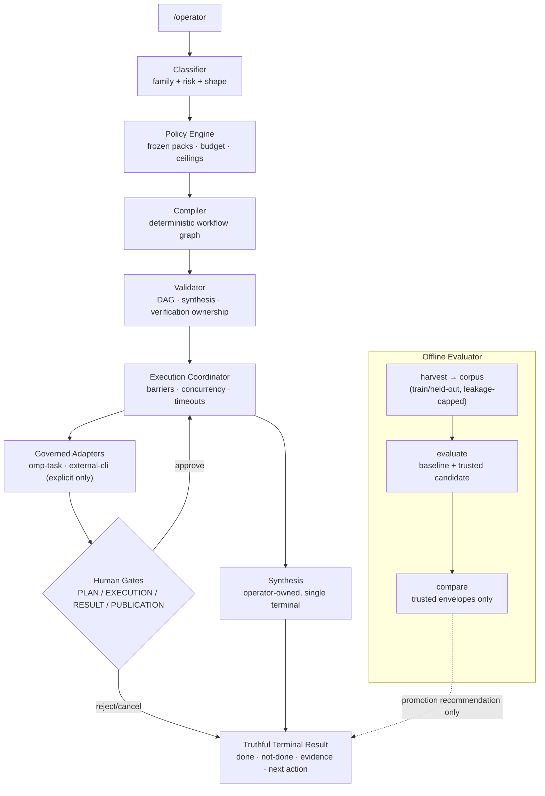

# Agent Operator

A governed, multi-stage workflow operator for OMP (Oh My Pi). It turns a free-form request into a **classified, compiled, gate-checked workflow** — with human approval gates, hard policy invariants, provider-fleet governance, and an offline evaluator for baseline-vs-candidate qualification. **Nothing runs, mutates, publishes, or promotes without explicit human authority.**

## What it does

```
/operator plan the migration approach to striped tables
```

1. **Classify** the request (RESEARCH / PLAN / IMPLEMENT / REVIEW / UI / QA / SECURITY / OPERATIONS, or explicit DIRECT intent)
2. **Compile** a deterministic workflow graph (SINGLE / PARALLEL / PIPELINE shapes) with capability-matched nodes
3. **Validate** the graph (DAG invariants, verification ownership, synthesis ownership, parallel-group rules)
4. **Dispatch** nodes through governed adapters with dependency barriers, concurrency ceilings, timeouts, and stale/duplicate-result rejection
5. **Pause at human gates** — `PLAN_APPROVAL`, `EXECUTION_APPROVAL`, `RESULT_APPROVAL`, `PUBLICATION_APPROVAL` — bound to the exact session + graph revision
6. **Synthesize** a truthful terminal result: what ran, what changed, what was verified, what was *not* done, and the next allowed action

Type `/operator` + space for the full arrow-navigable command menu.

## Command surface

| Command | Purpose |
|---|---|
| `/operator <request>` | Start a governed workflow session |
| `/operator --dry-run <request>` | Preflight without dispatching |
| `/operator --explain <request>` | Routing explanation only |
| `/operator status · graph · why · explain` | Session / graph / routing detail |
| `/operator continue · cancel` | Drive the active session |
| `/operator approve · reject <gate-id>` | Human-gate decisions (revision-bound) |
| `/operator resume <session-id>` | Reload a persisted session after restart |
| `/operator improve …` | Offline evaluator (see below) |

## The evaluator (`improve`)

An offline, promotion-recommendation-only subsystem:

- **harvest** — drafts evaluation cases from operator sessions (always `LOCAL_ONLY` until human curation)
- **corpus** — seals an immutable train/held-out partition (write-once, adaptive-leakage capped at 3 campaigns)
- **generate** — emits train-only candidate-generation input (held-out ids structurally unrepresentable)
- **evaluate** — deterministic structural scoring of baseline, and — via an injected trusted executor — of a verified candidate bundle; both sides emit provenance-complete score envelopes (run/corpus/digests/spec/scorer-version/budget bound)
- **compare** — consumes **only** evaluator-produced trusted envelopes; hard-gate failures override numeric improvement; externally authored scores are rejected by design
- **candidate verify / compare --candidate-bundle** — write-once bundle verification with prohibited-component rejection

**Promotion is always human-only** (`promotedBySystem` is structurally `false`).

## Trust model

- Hard invariants (auto-commit/push/merge, auto-routing, hidden fleet activation) are **locked false** under every trust profile
- Trusted startup flags gate the evaluator and external providers; untrusted policy sources fail closed
- Mutation ceilings: `MUTATING` capability records are unreachable; path/symlink escapes rejected; no automatic retry after ambiguous mutation
- Secrets: automated scans at curation-upgrade **and** external-dispatch time; evidence scrubbed before it leaves any boundary
- External CLI runtimes: data-driven, operator-curated catalog, explicit invocation only, allowlisted env/argv, SHA-256 binary pinning

## Install

```bash
git clone https://github.com/osamam-eid/agent-operator.git
cd agent-operator
./install.sh
```

Then restart OMP. Type `/operator` and press space for the command menu.

## Architecture



## Status

v1.0.0 — qualified through an 11-stage governed program (frozen contract stages → evaluator subsystem → full-system qualification with a 7-slice evidence matrix). See `SKILL.md` for the operator skill contract.
