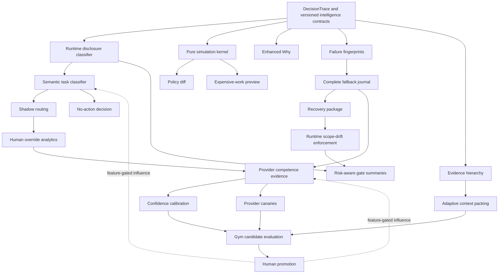
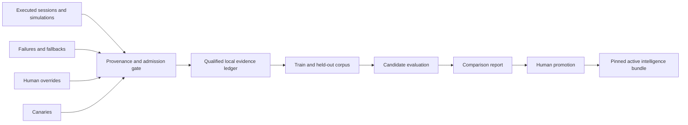

# Agent Operator Intelligence Improvement Plan

## Priority decision

The program should begin with **decision safety and decision evidence**, not provider ranking.

Recommended priorities:

1. **Runtime disclosure classification before any external-provider eligibility check.** This closes the clearest current safety gap.
2. **A production semantic classifier boundary, initially shadow-only, with deterministic policy validation and an explicit family override.** The current keyword classifier is a test fixture, not a durable natural-language router.
3. **A truly side-effect-free `/operator simulate` plus structured decision provenance.** The current `--dry-run` compiles and preflights but still creates and persists an active session.
4. **Enhanced `/operator why` backed by the same structured decision record used by compilation.** No post-hoc explanation generation.
5. **Failure fingerprints and complete fallback journaling.** This closes an existing Stage-9 residual and prevents repeated known-bad attempts.
6. **Recovery packages, runtime scope-drift checks, and risk-aware gate summaries.** These strengthen governed mutation without inventing new gate semantics.
7. **Passive provider competence and human-override evidence collection.** Evidence first; routing influence later.
8. **Confidence calibration and provider canaries only after enough qualified evidence exists.**
9. **Adaptive context and evidence compression after decision/evidence provenance is stable.**
10. **Gym integration and controlled intelligence activation last.** Human promotion remains mandatory.

Do not build either an Operator health dashboard or a graphical/web Operator dashboard. CLI-native inspection is sufficient.

## Current-state assessment

### Reusable Stage-1–11 components

| Existing component | Reuse in this program |
|---|---|
| `src/classifier.ts` and `OperatorClassifier` | Preserve the interface seam; replace the production default behind a flag. Retain the fixture classifier for deterministic tests/offline fallback only. |
| `src/compiler.ts` | Remains the single real classification → policy → template → capability → graph path for execute, simulate, shadow, and policy comparison. |
| `src/policy.ts` and `src/config.ts` | Continue to own hard policy resolution, project overlay trust, budget ceilings, review requirements, and monotonic tightening. |
| `src/contracts.ts` | Reuse `RouteDecision`, `PolicyDecision`, `ExecutionGraph`, `HumanGate`, `HumanDecisionRecord`, `MutationClass`, `ScopeStatus`, `ScopeDeviation`, evidence, artifact, usage, and final-result contracts. |
| `src/commands.ts` | Extend the typed command grammar. Preserve current commands and aliases. |
| `src/controller.ts` | Reuse the lifecycle for execution, but keep simulation outside `startSession()` and persistence. |
| `src/graph.ts` and `src/workflow-templates.ts` | Use the real graph compiler and registered templates; do not create a second planning engine. |
| `src/registry.ts` | Reuse capability eligibility and role independence. Intelligence may rank only after registry and policy eligibility. |
| `src/provider-fleet.ts` and `src/fleet-catalog.ts` | Reuse provider/model normalization, health, hard compatibility filtering, tool/mutability ceilings, and explicit preference handling. Catalog metadata remains declared capability, not competence proof. |
| `src/journal.ts` | Extend the existing typed journal and `appendFallbackDecision()` rather than creating a separate telemetry system. |
| `src/store.ts` | Reuse atomic session persistence and conflict handling. Intelligence records need their own versioned local store so old session readers do not silently drop new fields. |
| `src/context-projection.ts` | Reuse `shared`, `isolated`, `summary-only`, `artifact-only`, and `evidence-only` delivery modes. Add requirement priority separately. |
| `src/mutation/*` and `src/stage7/cleanup.ts` | Reuse governed worktree identity, reconciliation, cleanup ledger, provisional quarantine, and mutation manifests for recovery and drift detection. |
| `src/stage7/gate-presenter.ts` | Extend gate presentation with risk-specific summaries; do not add new approval semantics unless an existing gate cannot represent the decision. |
| `src/evaluator/*` | Reuse harvest, disclosure-separated corpora, secret scanning, deterministic scoring, held-out comparison, candidate digest binding, live replay seams, reports, and human-only promotion. |

### Current gaps confirmed in code

- `createMockOperatorClassifier()` is a literal phrase scorer. It cannot serve as a robust production semantic classifier.
- `--dry-run` already compiles and can run non-dispatching preflight, but `controller.ts` then calls `startSession()`, persists the record, and makes it active. That does not satisfy the requested zero-mutation simulation contract.
- `/operator why` already reports real `RouteDecision` fields, including rejected alternatives and fallback decisions, but the decision contract does not retain a complete causal trace for every eligibility and policy step.
- Runtime provider selection does not have a first-class disclosure decision before external-provider eligibility. The stronger disclosure vocabulary currently exists mainly in evaluator replay.
- Stage 9 already journals a bounded fallback decision, but not the complete attempt/rejection/outcome chain requested here.
- `ScopeStatus` and `ScopeDeviation` exist in final results; material drift is not yet enforced continuously before proposed mutations.
- Human decisions and evaluator `humanOverrideSignals` exist, but there is no normalized override analytics record or evidence-admission policy.
- Context projection already supports several representations, but not an evidence-tested optimizer that distinguishes required relevance from delivery form.

## Additions recommended on top of the 19 improvements

These are supporting controls, not new orchestration features or agent types.

1. **`DecisionTrace.v1` provenance spine.** Every classification, eligibility rejection, policy rule, cost estimate, fallback, and human override gets a typed reason code and source reference. Simulation, Why, shadow comparison, scorecards, and Gym all consume the same record.
2. **Explicit task-family override.** Proposed UX: `/operator --family PLAN <request>`. It bypasses semantic family guessing only; it never bypasses disclosure, risk, policy, provider eligibility, mutation ceilings, or gates.
3. **Prediction identity binding.** Store classifier kind, provider/model identity when applicable, prompt/template version, schema version, policy digest, catalog digest, and graph compiler version with every prediction. Calibration is meaningless without this version identity.
4. **Intelligence evidence admission and quarantine.** Incomplete runs, unverified outcomes, duplicated cases, contaminated held-out data, ambiguous mutations, and unreviewed human overrides cannot become positive competence evidence.
5. **Versioned intelligence-store migrations.** Do not add intelligence fields directly to old records without updating every reconstructing reader. Use additive envelopes and explicit migration/ignore rules.

## Classification architecture

### Decision

Use a **two-boundary classifier**, not a larger keyword list:

1. **Local deterministic disclosure preflight** runs first, before any request content can be sent to an external classifier or provider.
2. **Semantic task classifier** returns a proposal only after the disclosure decision establishes which classifier providers, if any, are eligible.
3. **Deterministic validator and policy engine** derive or constrain risk, capabilities, execution shape, budget, provider eligibility, mutation class, and gates.

The semantic model may propose intent. It must not grant authority.

### Proposed contracts

```ts
interface SemanticClassificationProposal {
  family: TaskFamily;
  rawConfidence: number;              // 0..1, uncalibrated
  alternatives: readonly {
    family: TaskFamily;
    rawConfidence: number;
  }[];
  decomposable: boolean;
  intentEvidence: readonly string[];  // bounded spans/reason codes, not chain-of-thought
  requestedShape?: ExecutionShape;
  classifierIdentity: PredictionIdentity;
}

interface ClassificationDecision {
  proposal: SemanticClassificationProposal;
  calibratedConfidence?: number;
  disposition: 'CONTINUE' | 'ABSTAIN' | 'HUMAN_FAMILY_REQUIRED';
  selectedFamily?: TaskFamily;
  policyRefs: readonly PolicyRef[];
  traceRef: string;
}
```

Risk and disclosure are separate decisions. A model-proposed risk signal may raise scrutiny, but deterministic policy owns the effective risk floor.

### Failure behavior

- Classifier timeout, schema violation, unavailable eligible model, or low confidence: abstain and request a family choice.
- Never silently fall back from failed semantic classification to a weak keyword guess for execution.
- Deterministic fixtures may support tests, explicit controls, and a clearly labeled offline compatibility mode that can only abstain or use an explicit family.
- Prompt injection inside the request cannot alter the classifier schema, policy, tools, or provider eligibility.

### Initial rollout

- Default off.
- Run semantic proposals in shadow against a fixed labeled corpus and sampled approved sessions.
- Compare incumbent route, semantic proposal, human choice, and final verified outcome.
- Activate only after held-out evaluation and human promotion.

## Improvement dependency graph



## Proposed stages/work packages

## WP12 — Decision foundation, disclosure, simulation, and explanation

### Objective

Create the reusable, read-only decision spine needed by every later intelligence feature and close the pre-provider disclosure gap.

### Features included

- 18. Local-only/disclosure classifier.
- 2. `/operator simulate`.
- 6. Enhanced `/operator why`.
- Supporting `DecisionTrace.v1`, prediction identity, and versioned intelligence envelopes.
- Classification contracts and explicit `--family` syntax, but no semantic classifier activation yet.

### Why these features belong together

Disclosure, simulation, and explanation must consume the exact same compiler and policy decisions. Building separate report logic would allow the displayed explanation to diverge from the executable decision.

### Existing components reused

`Stage3WorkflowCompiler`, `resolvePolicy()`, project overlay trust, `RouteDecision`, `PolicyDecision`, `ExecutionGraph`, registry selection, `--dry-run` preflight, evaluator disclosure vocabulary, secret scanning, and journal reason codes.

### New components/contracts required

- `RuntimeDisclosureDecision.v1`.
- `DecisionTrace.v1` and `DecisionTraceEntry`.
- `PredictionIdentity.v1`.
- `SimulationResultEnvelope.v1`.
- Explicit mapping between runtime disclosure and evaluator disclosure classes.

Recommended runtime disclosure vocabulary:

- `LOCAL_ONLY`
- `INTERNAL_REDACTABLE`
- `EXTERNAL_ALLOWED`
- `UNKNOWN` only as an internal transient value; it fails closed as `LOCAL_ONLY` for provider eligibility.

### State/persistence changes

- Simulation writes no session, journal, gate, artifact, or provider state.
- Decision traces for executed sessions are stored by reference in the existing session envelope.
- Simulation output is ephemeral unless the human explicitly exports it; export is outside this work package.
- Version intelligence envelopes independently from stored-session schema.

### User-facing commands

- Canonical: `/operator simulate "<request>"`.
- Preserve `--dry-run` as a compatibility alias, but change both to the same no-persistence behavior.
- `/operator why [session-id]`; omitted ID continues to inspect the active session.
- `/operator --family PLAN <request>`.

Simulation output: classification, disclosure, risk, workflow, graph, roles, eligible candidates, selected and rejected candidates with reason codes, capabilities, tools, gates, mutation class, artifacts/evidence, cost/depth/call estimates, and fallback policy.

### Policy/security implications

- Disclosure executes before external classifier/provider eligibility.
- Explicit user permission can widen only within hard project/global policy and cannot override secrets or restricted artifact classes.
- Simulation cannot call execution adapters or create a provider session.
- Why renders stored structured facts and bounded rationale, never newly generated explanation prose.

### Gym/evaluation implications

Adds the common decision envelope needed to compare predictions to outcomes. No active learning or routing influence.

### Migration/compatibility impact

Additive command variants and optional trace references. Existing `--dry-run` users receive safer behavior but no longer get a persisted active session; document this intentional semantic correction.

### Tests

- Simulation graph and route equal an immediately following execute compile under the same pinned inputs.
- Zero persistence/provider/tool calls.
- Why renders every stored trace entry and exact policy reference.
- Disclosure vocabulary mapping to evaluator cases.
- Explicit-family parsing and deterministic policy validation.

### Negative/adversarial tests

- Secret or restricted path in an apparently harmless research request blocks external eligibility.
- `--family` cannot lower risk or disclosure.
- Malformed classifier/trace data fails schema validation.
- Simulation cannot acquire mutation grants, open gates, or write state.
- Why redacts bounded sensitive fields and never displays raw secret matches.

### Completion criteria

All simulations use the production compiler/policy path; installed behavior demonstrates zero state diff and zero dispatch; disclosure is enforced before every external-provider seam; Why is trace-complete.

### Non-goals

No semantic routing activation, competence ranking, dashboards, execution replay, or policy application.

### Rollback strategy

Disable new commands and trace emission via startup flag; retain current execute compiler. Disclosure enforcement is security-tightening and may only roll back to local-only fail-closed behavior, not to unrestricted external routing.

## WP13 — Semantic classification, shadow routing, and no-action

### Objective

Replace fixture-based natural-language routing with a governed semantic proposal while collecting evidence before allowing it to control execution.

### Features included

- Production semantic classifier boundary.
- 1. Shadow routing mode.
- 15. `DO_NOT_EXECUTE` as a first-class decision.
- Classification-specific labeled corpus and abstention UX.

### Why these features belong together

Shadow mode is the safe evidence path for the new classifier. No-action is a semantic disposition and must use the same calibration, provenance, and policy rules rather than becoming another keyword shortcut.

### Existing components reused

`OperatorClassifier`, classification proposal, compiler abstention, evaluator corpus/scoring, session journal, final recommendation/status, and the WP12 decision trace.

### New components/contracts required

- `SemanticClassificationProposal.v1` and `ClassificationDecision.v1`.
- `DecisionDisposition = EXECUTE | DO_NOT_EXECUTE | NEEDS_CLARIFICATION` separate from `TaskFamily`; do not reopen the frozen family enum merely to add `NO_ACTION`.
- `ShadowRouteObservation.v1` with incumbent route, candidate route, policy/catalog digests, later actual route, human override, and verified outcome references.

### State/persistence changes

Store bounded structured observations only. Never store model chain-of-thought. Shadow records remain local and are excluded from competence positives until the outcome is verified.

### User-facing commands

- `/operator shadow evaluate "<request>"`: one non-executing comparison.
- `/operator shadow on|off|status`: enable passive candidate comparison for future real sessions; default off.
- Clarification offers explicit family choices.
- `DO_NOT_EXECUTE` output contains reason code, evidence refs, and what information/action would change the decision.

### Policy/security implications

The classifier model is selected only from disclosure-eligible providers. Shadow output cannot alter incumbent route, provider selection, graph, gates, or fallback. No-action cannot become a generic refusal or bypass required work.

### Gym/evaluation implications

Create held-out classification cases including typos, paraphrases, mixed intents, multilingual/mixed-language prompts, prompt injection, no-action, and ambiguity. Compare semantic proposals to curated labels and verified outcomes.

### Migration/compatibility impact

Fixture classifier stays available for tests. Production semantic classifier is default-off and shadow-only until promoted. Existing TaskFamily and workflow templates stay unchanged.

### Tests

- Structured-output validation and deterministic sanitization.
- Explicit family override.
- Abstention and clarification.
- Incumbent route remains byte-identical with shadow enabled.
- Correct no-action decisions create no execution graph or adapter call.

### Negative/adversarial tests

- Request text attempts to rewrite system policy or output schema.
- Classifier provider is disclosure-ineligible.
- Mixed security/implementation intent cannot be under-classified.
- No-action cannot classify mutation, missing approval, or out-of-scope requests as “already satisfied” without evidence.

### Completion criteria

Held-out classifier evaluation meets an approved threshold; zero policy bypasses; shadow causes no route changes; human explicitly approves any activation beyond shadow.

### Non-goals

No online learning, no autonomous prompt updates, no new agent role, and no automatic expensive council trigger from low confidence alone.

### Rollback strategy

Turn off semantic and shadow flags. Explicit-family plus deterministic abstention remain available. Preserve observations for audit but exclude them from active routing.

## WP14 — Failure, fallback, recovery, drift, and approval safety

### Objective

Make repeated failures recognizable and mutation recovery explainable before intelligence influences provider choice.

### Features included

- 10. Failure fingerprinting.
- 11. Complete journaled fallback.
- 9. Recovery package.
- 16. Intent/scope drift detection.
- 8. Risk-aware approval UX.

### Why these features belong together

They share the execution journal, mutation reconciliation, worktree identity, and human gate boundary. A fallback cannot be judged safe without mutation state; a recovery cannot be approved without drift and risk evidence.

### Existing components reused

`StopDetail`, provider selection error codes, node outcomes, `appendFallbackDecision()`, `HumanGate`, `HumanDecisionRecord`, worktree reconciliation, cleanup ledger, provisional quarantine, `ScopeStatus`, `ScopeDeviation`, graph hash, artifact/evidence manifests.

### New components/contracts required

- `FailureFingerprint.v1`.
- `FallbackAttemptJournal.v1` and `FallbackChainOutcome.v1`.
- `RecoveryPackage.v1`.
- `RuntimeScopeComparison.v1`.
- `GateRiskSummary.v1`.

### State/persistence changes

Failure records contain canonical reason codes and hashes, not raw prompts or full stack traces. Recovery packages reference existing evidence/diffs by digest. Fallback attempts append to the existing session journal. Pre-existing working-tree changes are recorded as baseline-owned and never included as rollback targets.

### User-facing commands

- `/operator why` explains fallback hops from the journal.
- `/operator recovery status [session-id]`.
- `/operator rollback <session-id>` may be added only after governed recovery preparation exists; rollback always opens the appropriate existing mutation gate.

### Policy/security implications

- No automatic fallback after ambiguous mutation or unknown provider outcome.
- Fingerprints may suppress a known-bad candidate only after policy eligibility; they cannot make an ineligible candidate eligible.
- Drift threshold is material: changed goal, unapproved path/system, mutation-class escalation, requirement removal, or graph output outside the frozen plan. Harmless implementation detail does not block.
- Existing gate types remain; presentation changes by risk tier.

### Gym/evaluation implications

Fingerprint recurrence, fallback outcomes, recovery quality, and drift correctness become evaluation evidence. They do not train or update routing online.

### Migration/compatibility impact

Additive journal event types and recovery references. Old sessions render partial Why output and never fabricate missing provenance.

### Tests

- Stable fingerprints for equivalent normalized failures.
- Different security/mutation contexts never collide.
- Full fallback candidate/rejection/outcome journal.
- Crash recovery with exact graph/worktree binding.
- Risk summaries for read-only, local mutation, publication, and promotion.

### Negative/adversarial tests

- Secret-bearing error strings never enter fingerprints.
- Auth failure cannot trigger fallback to a disclosure-incompatible provider.
- Unknown mutation outcome blocks fallback and rollback.
- Rollback cannot overwrite pre-existing user changes.
- Scope expansion disguised as refactoring triggers `SCOPE_DRIFT_DETECTED`.
- Stale gate/graph digest cannot be approved.

### Completion criteria

Every fallback is reconstructable from typed evidence; repeated failures are recognized without sensitive payload storage; recovery is governed and protects pre-existing work; material drift blocks before mutation.

### Non-goals

No silent undo, no automatic provider quarantine from one failure, no new approval authority, and no generic semantic policing of implementation style.

### Rollback strategy

Disable fingerprint-based candidate suppression and drift enforcement independently while retaining journals. Recovery artifacts remain read-only audit evidence until safely expired.

## WP15 — Provider competence and human-feedback evidence collection

### Objective

Build trustworthy empirical records without allowing them to change routes.

### Features included

- 3. Provider/model competence scorecards.
- 14. Human override analytics.
- 17. Provider canary corpus and record format, collection-only.
- Passive shadow/failure/fallback outcome aggregation.

### Why these features belong together

Competence cannot be inferred from catalog declarations or success count alone. It needs qualified outcomes, human signals, failures, cost, latency, recency, model identity, and disclosure context under one evidence-admission policy.

### Existing components reused

Fleet catalog/model descriptors, `CapabilityRecord`, evaluator replay evidence, case scores, corpus partitions, human decisions, override signals, usage stats, failure/fallback journals, candidate digest and scorer version.

### New components/contracts required

```ts
interface ProviderCompetenceKey {
  providerId: string;
  modelId: string;
  role: string;
  taskFamily: TaskFamily;
  capabilityId: string;
}

interface ProviderCompetenceSnapshot {
  key: ProviderCompetenceKey;
  qualifiedSampleCount: number;
  effectiveSampleWeight: number;
  successRate: number;
  hardFailureRate: number;
  qualityScore: number;
  latencyQuantilesMs: readonly number[];
  costPerSuccessfulCase?: number;
  toolReliabilityRate?: number;
  confidenceInterval: readonly [number, number];
  evidenceWindow: { from: string; to: string };
  qualificationSources: readonly string[];
  lastQualifiedAt: string;
  provenanceRefs: readonly string[];
  policyDigest: string;
}
```

Also add `HumanOverrideSignal.v1`, `EvidenceAdmissionDecision.v1`, and `ProviderCanaryObservation.v1`.

### State/persistence changes

Use an append-only qualified-evidence ledger plus rebuildable aggregate snapshots. Do not write competence into the operator-owned provider catalog. Catalog and competence remain separate sources with separate authority.

### User-facing commands

- `/operator competence show <provider> [model]` for CLI inspection.
- `/operator canary status [provider]` only after canary execution exists.
- No routing-changing command in this work package.

### Policy/security implications

Scorecards cannot override explicit human provider choice, disclosure, tool/mutation ceilings, provider health, minimum model tier, or cost ceiling. Human override is a signal, not correctness truth.

### Gym/evaluation implications

Gym owns evidence qualification and aggregate rebuilds. Use uncertainty intervals and recency/version partitions. One successful run never creates high confidence. Keep train and held-out sources distinct.

### Migration/compatibility impact

New local intelligence store only. Existing fleet catalog schema remains unchanged.

### Tests

- Aggregate rebuild determinism.
- Provider and model versions remain separated.
- Per-role/task/capability slices do not bleed into one another.
- Duplicate, incomplete, unverified, and contaminated cases are excluded.
- Override metrics distinguish rejection, reroute, retry, cancellation, and finding disposition.

### Negative/adversarial tests

- Many trivial successes cannot outweigh a hard security failure for a different required capability.
- Human preference cannot be mislabeled as verified provider correctness.
- Catalog metadata cannot enter competence as evidence.
- Poisoned or duplicated sessions cannot inflate sample size.

### Completion criteria

Scorecards are reproducible from admitted evidence, expose sample size/confidence/recency/provenance, and have zero effect on active routing.

### Non-goals

No automatic provider promotion, no catalog rewriting, no global undifferentiated provider score, and no production canary scheduler.

### Rollback strategy

Stop collectors and rebuild or discard derived snapshots. Source session/evaluator evidence remains authoritative under existing retention policy.

## WP16 — Policy diff, expensive-work preview, and bounded cost controls

### Objective

Let humans understand policy and cost consequences before execution or activation.

### Features included

- 7. Policy simulator/policy diff.
- 5. Expensive-work decision preview.
- Cost/depth/call estimation shared with simulation.

### Why these features belong together

Both compare a proposed decision to current constraints using the pure simulation kernel. They are policy-facing read-only tools, not routing intelligence.

### Existing components reused

Config/project-overlay loading, policy-pack resolution, compiler, graph, budget profiles/effects, capability/provider selection, existing execution/plan gates, policy refs, and WP12 DecisionTrace.

### New components/contracts required

- `PolicyDiffReport.v1`.
- `ExecutionEstimate.v1` with estimate confidence and provenance.
- `ExpensiveWorkPreview.v1` rendered inside an existing approval gate.

### State/persistence changes

Policy tests and previews are ephemeral. Active-session approval records retain the exact estimate digest shown to the human.

### User-facing commands

- `/operator policy test --proposed <path> [--corpus <id>]`.
- `/operator simulate` includes estimates.
- Existing approval command presents Run / Modify / Cancel through existing gate options where representable.

### Policy/security implications

Hard-locked fields are immutable in both current and proposed policy. Policy testing never writes or trusts the proposed file. Preview is required by configured cost threshold, council, external provider, large graph, high-risk mutation, or explicit user policy. Low confidence alone never automatically triggers council or expensive execution.

### Gym/evaluation implications

Estimate accuracy becomes an offline metric after actual outcomes exist. Policy diffs can become regression fixtures but never apply themselves.

### Migration/compatibility impact

Additive commands and optional estimate digest on human decisions. No change to existing gate authority.

### Tests

- Current/proposed policy comparisons across a fixed request corpus.
- Exact reporting of workflow, provider eligibility, mutation, gates, disclosure, and cost deltas.
- Preview triggers and non-triggers.
- Estimate-versus-actual capture.

### Negative/adversarial tests

- Proposed config attempts to weaken hard invariants.
- Symlink/path traversal in proposed policy path.
- Stale preview digest cannot authorize a changed graph.
- Unknown cost is displayed as unknown, never zero.

### Completion criteria

Policy tests produce deterministic diffs without state mutation; expensive workflows cannot execute without the configured existing gate showing a digest-bound preview.

### Non-goals

No policy editor, auto-application, dashboard, or exact-cost guarantee.

### Rollback strategy

Remove command exposure and preview trigger while retaining unchanged policy resolution and gate behavior.

## WP17 — Evidence hierarchy and adaptive context

### Objective

Reduce cost and cognitive load without sacrificing required context, security evidence, or raw auditability.

### Features included

- 13. Evidence compression/progressive disclosure.
- 12. Adaptive context packing.

### Why these features belong together

Adaptive packing needs trusted normalized evidence and summaries. Compression without context-use measurements cannot prove value.

### Existing components reused

Evidence and artifact manifests, checksums, context policies, projection size failures, QA evidence verification, summaries, and evaluator replay.

### New components/contracts required

Separate two dimensions:

- Requirement: `REQUIRED | RELEVANT | OPTIONAL | FORBIDDEN`.
- Representation: `FULL | SYMBOL_EXCERPT | SUMMARY | ARTIFACT_REFERENCE | EVIDENCE_ONLY`.

Add `ContextItemDecision.v1`, `ContextProjectionManifest.v1`, `EvidenceNormalizationRecord.v1`, and `DecisionBrief.v1`.

### State/persistence changes

Raw evidence stays immutable by digest. Normalized evidence and decision briefs reference raw records. Lossless compression may replace storage representation only after checksum verification; lossy summary never replaces authoritative raw evidence.

### User-facing commands

No new command required. `/operator why` and approval views use progressive disclosure and artifact references.

### Policy/security implications

Required policy, human instruction, secret/disclosure labels, mutation grants, and blocking findings cannot be dropped or summarized away. `FORBIDDEN` content is excluded before provider dispatch. Overflow of required context blocks rather than silently truncates.

### Gym/evaluation implications

Compare full versus packed candidates on correctness, security, extra tool calls, reruns, latency, and cost. Token reduction alone cannot win promotion.

### Migration/compatibility impact

Additive projection manifests. Existing static context policies remain the default and fallback.

### Tests

- Deterministic packing under a pinned model context limit.
- Required-item preservation.
- Raw/normalized/brief linkage and digest verification.
- Retention/deduplication behavior.
- Cost and rerun measurements.

### Negative/adversarial tests

- Security finding hidden only in omitted log tail.
- Summary contradicts raw evidence.
- Secret-bearing optional context marked relevant by a model.
- Context reduction causes extra tools/reruns and is rejected by evaluator.

### Completion criteria

Packed candidates pass held-out equivalence/security gates and show bounded total-cost improvement; humans can navigate from brief to normalized to raw evidence.

### Non-goals

No minimum-token objective, no deletion of raw authoritative evidence, no model memory as provenance, and no automatic activation.

### Rollback strategy

Use existing static context projection and raw evidence rendering. Derived summaries remain non-authoritative or are discarded.

## WP18 — Calibration, canaries, and governed Gym activation

### Objective

Turn qualified evidence into evaluated candidates without online autonomous learning.

### Features included

- 4. Confidence calibration.
- 17. Provider canary execution and regression detection.
- 19. Intelligence feedback loop.
- Controlled routing influence for competence, fingerprints, calibrated abstention, and context packing.

### Why these features belong together

All alter behavior or provider status. They require sufficient evidence, held-out evaluation, version binding, safety gates, and human promotion.

### Existing components reused

Evaluator corpus, disclosure partitions, secret scan, deterministic structural scorer, live replay, candidate manifests/digests, baseline/candidate envelopes, comparison, reports, adaptive leakage cap, and `promotedBySystem: false`.

### New components/contracts required

- `ConfidencePrediction.v1` and `CalibrationReport.v1`.
- `ProviderCanaryRun.v1` and `ProviderRegressionDecision.v1`.
- `IntelligenceCandidateManifest.v1` linking exact classifier/ranker/context configuration and data snapshot.

### State/persistence changes

Store raw predictions separately from later labels. Calibration models and competence rankers are immutable candidate bundles with data-window, policy, scorer, and model identities. Active pointers change only through human promotion.

### User-facing commands

Reuse `/operator improve` for harvest, corpus, evaluate, compare, and candidate verification. Add only:

- `/operator canary run <provider> [--budget <profile>]`.
- `/operator improve intelligence status` if the existing namespace needs one aggregate status.

### Policy/security implications

Calibration may increase abstention or human confirmation but cannot lower hard risk/disclosure/mutation rules. Canary degradation requires repeated qualified evidence; one failure records an observation, not automatic removal. Explicit human provider selection remains authoritative if policy-compatible.

### Gym/evaluation implications

Measure classification/workflow/provider/risk/recommendation calibration separately using Brier score, reliability bins, expected calibration error, sample size, recency, and held-out correctness. Partition by task family and prediction identity; do not pool incompatible model/prompt versions.

### Migration/compatibility impact

All active intelligence remains default-off. Existing routes remain baseline candidates. Promotion records bind exact bundle hashes.

### Tests

- Train/held-out isolation and deterministic rebuild.
- Calibration metrics on known synthetic distributions.
- Insufficient-sample behavior.
- Canary repeated-failure and recovery rules.
- Promoted candidate identity and rollback.
- Normal execution latency unchanged when intelligence is off.

### Negative/adversarial tests

- Online observations cannot mutate active calibration/ranking.
- One success cannot produce high confidence.
- One canary failure cannot remove a provider.
- Human override alone cannot become a correctness label.
- Promotion with stale policy/data/model digest fails.
- Low confidence cannot auto-trigger expensive council execution.

### Completion criteria

Every behavior-changing candidate passes deterministic and held-out evaluation, security invariants, cost ceilings, and human promotion. Rollback to the prior active bundle is digest-verified and immediate.

### Non-goals

No autonomous learning, self-promotion, continuous expensive canary schedule, or normal-path analytics query.

### Rollback strategy

Atomically restore the prior promoted candidate pointer. Continue collecting evidence under the old active behavior; investigate the rejected candidate offline.

## Provider competence design

### Unit of competence

Never publish a single global provider score. The key is:

`provider × model/version × role × task family × capability × tool/mutation profile`

A provider may be strong at planning and weak at tool use; a model version may regress independently.

### Evidence admission

Admit only evidence with:

- Exact provider/model identity.
- Exact role/capability and task-family label.
- Policy/catalog/compiler/scorer versions.
- Verified outcome or evaluator score.
- Disclosure-compatible execution.
- No ambiguous mutation or unresolved reconciliation.
- Non-duplicated case identity.
- Provenance references and integrity digests.

Separate sources: evaluator/Gym, approved live sessions, provider canaries, and human overrides. They receive different weights; human override is never ground truth by itself.

### Metrics

- Qualified sample count and effective sample weight.
- Quality score and hard-failure rate.
- Success confidence interval, not success rate alone.
- Recency and model-version identity.
- Latency distribution, not only mean.
- Cost per verified successful outcome.
- Tool reliability and context-overflow rate.
- Fallback success and repeated-failure fingerprints.

### Routing influence

1. Hard policy and disclosure filter.
2. Capability/model-tier/tool/mutation/health eligibility.
3. Explicit compatible human provider choice.
4. Approved competence candidate ranks only the remaining eligible set.
5. Cost/latency preference breaks close quality ties according to policy.
6. Insufficient evidence means no competence preference, not a negative score.

## Confidence calibration design

Record a prediction before its outcome:

- Dimension: classification, workflow, provider, risk, recommendation.
- Raw confidence and alternatives.
- Prediction identity and timestamp.
- Policy/catalog/compiler versions.
- Later label source and qualification status.

Compute calibration separately by dimension, family, and compatible prediction version. Use reliability bins, Brier score, expected calibration error, and sample-size/recency reports. A calibrator maps raw to calibrated confidence only after held-out approval.

Behavior rules:

- Low calibrated confidence may abstain, ask for family confirmation, require an existing human gate, or keep the incumbent route.
- It never automatically triggers council, external providers, mutation, or expensive fallback.
- Risk uncertainty raises or preserves the deterministic risk floor; it cannot lower it.
- Insufficient evidence returns `UNAVAILABLE`, not a fabricated probability.

## Failure fingerprint + fallback design

### Canonical fingerprint inputs

- Typed reason code.
- Provider/model/adapter.
- Role/capability/task family.
- Execution phase and tool category.
- Mutation/reconciliation state.
- Bounded status/exit/error category.
- Policy/catalog/compiler version.

Exclude raw prompts, credentials, authorization headers, full stack traces, customer data, and unrestricted file contents. Hash the canonical normalized record; retain a redacted structured description.

### Fingerprint lifecycle

`OBSERVED → CONFIRMED_RECURRENT → MITIGATED | EXPIRED | REJECTED`

Only validated recurrent fingerprints may influence fallback ordering or temporary candidate suppression. One observation never removes a provider.

### Fallback journal

Every attempt records initial choice, trigger fingerprint, exact policy decision, eligible and rejected candidates, capability/disclosure/mutation comparisons, selected fallback, estimated cost delta, attempt result, and final chain outcome.

Fallback stops when:

- Mutation outcome is unknown.
- Reconciliation is required.
- No disclosure-compatible candidate remains.
- Capability/model-tier/tool ceiling would be weakened.
- Budget or retry ceiling is reached.
- Human provider selection forbids automatic substitution.

## Disclosure classifier design

### Precedence

1. Explicit project/global policy and project trust.
2. Local secret and sensitive-data scan.
3. Artifact/path/data-type labels.
4. Explicit user disclosure instruction, constrained by 1–3.
5. Optional semantic proposal using only an already disclosure-eligible local/provider boundary.
6. Deterministic effective classification.
7. Provider eligibility.

### Fail-closed behavior

- Unknown, conflicting, classifier failure, or unscannable required input becomes `LOCAL_ONLY`.
- Redaction produces a new digest-bound artifact; it never reclassifies the original artifact.
- Provider selection cannot retroactively redefine disclosure.
- The decision stores reason codes and sensitive-category names, never matched secret values.

### Required tests

Nested archives, symlinks/path escapes, generated artifacts, mixed public/private inputs, malicious “external allowed” instructions, secret-like false positives, redaction integrity, and external fallback after a local provider failure.

## Adaptive context design

Each context item has both a requirement and representation decision. Deterministic policy fixes `REQUIRED` and `FORBIDDEN`; an optimizer may choose representation only for eligible `RELEVANT`/`OPTIONAL` items.

Optimization objective is **verified outcome quality subject to security and cost**, not minimum tokens. Compare total cost, including extra tool calls, reruns, failures, and latency. A smaller initial prompt that causes two reruns is a regression.

Candidate progression:

1. Record static baseline projection.
2. Produce a packed candidate plus full manifest.
3. Replay against evaluator cases.
4. Reject on any hard correctness/security regression.
5. Compare total cost and latency on held-out cases.
6. Human-promote a pinned packing policy.

## Human-feedback/Gym integration



Human signals are categorized, not blindly obeyed. A provider override can mean preference, availability, confidentiality, cost, or correctness; only a reviewed label may become evaluator truth.

## Commands UX

### `/operator simulate "<request>"`

- Pure compile/preflight path.
- No session, state file, journal, gate, provider session, model execution, tool call, or mutation.
- Uses the real compiler, policy, registry, fleet catalog snapshot, and disclosure decision.
- Output is a structured summary with an optional terminal-expanded graph.
- Existing `--dry-run` becomes an alias.

### `/operator why [session-id]`

Sections: classification, disclosure, effective risk, workflow, graph revision, role/provider decisions, rejected candidates, capabilities/tools, mutation, gates, cost/latency, confidence, fallback chain, policy refs, human overrides, and drift/recovery status. Every line links to a trace reason code/ref.

### `/operator shadow`

- `shadow evaluate "<request>"`: one non-executing candidate comparison.
- `shadow on|off|status`: passive comparison for later real sessions.
- Candidate output never changes active routing.
- Any semantic classifier call is disclosure-gated, bounded, and accounted as intelligence cost.

### `/operator policy test`

`/operator policy test --proposed <path> [--corpus <id>]`

Runs current and proposed policies over the same pinned requests and catalog/compiler snapshots. Reports workflow, eligibility, mutation, gate, disclosure, and estimate deltas plus unchanged hard invariants. Never writes or trusts the proposed policy.

### Additional command genuinely required

`/operator --family <TASK_FAMILY> <request>` for explicit family selection without policy bypass. Other inspection should extend existing `status`, `why`, `graph`, and `improve` namespaces rather than adding commands.

## Data retention/privacy

Recommended local defaults, always reducible by stricter project policy:

| Data | Default retention | Rules |
|---|---:|---|
| Simulation output | Memory only | No persistence by default. |
| Shadow observations | 30 days | Structured decisions only; no raw secret matches or chain-of-thought. |
| Raw non-audit execution evidence | 30 days after terminal session | Preserve longer only when project policy or an unresolved finding requires it. |
| Failure fingerprints | 90 days after last occurrence | Canonical redacted fields plus hash; expire inactive fingerprints. |
| Human override records | 180 days | Keep reason category and refs; exclude free-form sensitive content from analytics. |
| Qualified competence/calibration evidence | 12 months, partitioned by model/version | Routing uses only approved recent windows; older data is audit-only. |
| Canary results | 180 days or model retirement + 90 days | Keep failures needed for unresolved regression decisions. |
| Policy decisions, human gates, promotion records, publication digests | Permanent audit or stricter project retention | Never delete while they authorize an active artifact. |
| Derived aggregates/summaries | Rebuildable; retain while referenced | Delete when no active/promoted candidate references them. |

Never store in the intelligence layer: secrets, credentials, authorization headers, raw secret matches, decrypted data, unrestricted raw prompts containing local-only content, provider chain-of-thought, or copied source files. Store hashes, category codes, bounded redacted excerpts, and authoritative evidence references instead.

## Cost controls

- Normal execute path adds only local deterministic disclosure/policy checks while intelligence features are disabled.
- Semantic classification is at most one bounded, schema-constrained call; timeout abstains rather than cascading to another expensive model.
- Shadow sampling is default-off and budgeted by count, cost, and time window.
- Simulation uses no provider execution.
- Competence aggregation and calibration run offline through `/operator improve`, never synchronously on normal routing.
- Canaries are explicit or scheduled under a fixed approved budget; no continuous background campaign.
- Context candidates are evaluated on total successful-outcome cost, not token count alone.
- Unknown cost remains unknown and can trigger preview; it is never treated as zero.
- Routing-changing intelligence must demonstrate no material normal-path latency regression in held-out qualification.

## Rollout strategy

1. Add contracts, trace capture, pure simulation, and disclosure enforcement.
2. Run semantic classifier and shadow routing default-off against labeled/held-out cases.
3. Obtain human acceptance of classification quality and disclosure behavior.
4. Enable shadow-only collection for approved sessions.
5. Add failure/fallback/recovery safety records.
6. Collect provider, override, confidence, and context evidence without routing influence.
7. Build candidate bundles in Gym and evaluate against baseline/held-out data.
8. Human-promote one bounded behavior change at a time.
9. Canary the promoted change with immediate digest-based rollback available.

## Final recommended sequence

1. Freeze and version `DecisionTrace`, prediction identity, disclosure, simulation, and intelligence-admission contracts.
2. Implement runtime disclosure classification before any external classifier/provider eligibility.
3. Correct `--dry-run` into the side-effect-free simulation kernel and expose `/operator simulate`.
4. Upgrade `/operator why` to render the same trace; add explicit `--family`.
5. Add the semantic classifier in default-off shadow mode with abstention and clarification.
6. Add `DO_NOT_EXECUTE` as a disposition, not a new task family.
7. Complete failure fingerprints and fallback journaling.
8. Add governed recovery packages, material drift enforcement, and risk-aware gate summaries.
9. Add human-override normalization and evidence-admission quarantine.
10. Add provider/model/role/capability competence ledgers and passive scorecards.
11. Add policy diff and expensive-work preview using the simulation kernel.
12. Add evidence hierarchy and static-to-adaptive context candidate generation.
13. Add confidence calibration and provider canary evaluation after sample thresholds are met.
14. Connect all candidate intelligence to the existing Gym held-out comparison and human promotion flow.
15. Activate only one independently reversible intelligence candidate at a time.

## Open decisions

1. **Classifier execution boundary:** must semantic classification use only the current OMP-selected model, or may policy select another disclosure-compatible classifier model? Recommendation: start with the current OMP-selected model to avoid a second provider-routing problem inside classification.
2. **Local-only semantic classification:** if no approved local classifier is available, should `LOCAL_ONLY` requests require explicit `--family`, or may a configured trusted remote provider receive redacted text? Recommendation: require explicit family unless policy has approved a digest-bound redaction artifact.
3. **Retention:** approve or adjust the proposed 30/90/180-day/12-month local defaults according to project obligations.
4. **Activation thresholds:** sample sizes and calibration/competence promotion thresholds should be selected from initial evaluator variance, not hard-coded during planning. Human approval is required after the baseline report.

## Explicit exclusions

- No Operator health dashboard.
- No graphical or web dashboard.
- No new independent orchestration layer.
- No new agent types for feature count.
- No autonomous online learning or self-promotion.
- No provider catalog creation in this planning pass.
- No implementation, installation, policy change, routing enablement, evidence deletion, or expensive evaluation campaign.
